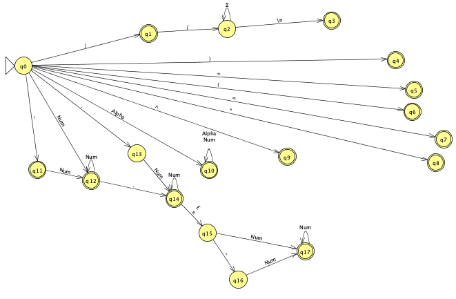

<div id="top"></div>

[![Contributors][contributors-shield]][contributors-url]
[![Forks][forks-shield]][forks-url]
[![Stargazers][stars-shield]][stars-url]
[![Issues][issues-shield]][issues-url]

<!-- PROJECT LOGO -->
<br />
<div align="center">
  <a href="https://github.com/josecarlosmemo/programming-a-dfa">
    
  </a>

<h3 align="center">Deterministic Finite Automata in Python</h3>

  <p align="center">
    A tokenizer implemented with a DFA, written in Python. Made for the Implementation of Computational Methods class at ITESM.
    <br />
    <a href="https://github.com/josecarlosmemo/programming-a-dfa"><strong>Explore the docs »</strong></a>
    <br />
    <br />
    <a href="https://github.com/josecarlosmemo/programming-a-dfa/issues">Report Bug</a>
    ·
    <a href="https://github.com/josecarlosmemo/programming-a-dfa/issues">Request Feature</a>
  </p>
</div>

<!-- TABLE OF CONTENTS -->
<details>
  <summary>Table of Contents</summary>
  <ol>
    <li>
      <a href="#about-the-project">About The Project</a>
      <ul>
        <li><a href="#built-with">Built With</a></li>
      </ul>
    </li>
    <li>
      <a href="#getting-started">Getting Started</a>
      <ul>
        <li><a href="#prerequisites">Prerequisites</a></li>
        <li><a href="#installation">Installation</a></li>
      </ul>
    </li>
    <li><a href="#contributing">Contributing</a></li>
    <!-- <li><a href="#contact">Contact</a></li> -->

  </ol>
</details>

<!-- ABOUT THE PROJECT -->

## About The Project

This program receives as input a text file containing arithmetic expressions and comments, and returns a table with each of its tokens found, in the order in which they were found and indicating what type they are.

### Token Types

| Integers                | Floating Point       |
| ----------------------- | -------------------- |
| Assignment (=)          | Addition (+)         |
| Subtraction (-)         | Multiplication (\*)  |
| Division (/)            | Power of (^)         |
| Variables               | Open Parenthesis "(" |
| Closing Parenthesis ")" | Comments (//)        |

### Deterministic Finite Automata

In a DFA, for each input symbol, one can determine the state to which the machine will move. Hence, it is called Deterministic Automata. As it has a finite number of states, the machine is called Deterministic Finite Machine or Deterministic Finite Automata. The following DFA represents how this program works:



<p align="right">(<a href="#top">back to top</a>)</p>

### Built With

<p align="left">
<a href="https://www.python.org" target="_blank" rel="noreferrer"></a>
</p>

<p align="right">(<a href="#top">back to top</a>)</p>

<!-- GETTING STARTED -->

## Getting Started

To run this program it is important to have Python 3.9 installed, once we have verified its installation we need to install the vital dependencies for the correct operation of the program

### Prerequisites

In this case we will install tabulate a library that allows us to print in a simple way data tables in our terminal. To do this we must run the following command

- pip packages

  ```sh
  pip3 install tabulate
  ```

### Installation

1. Clone the repo

   ```sh
   git clone https://github.com/josecarlosmemo/programming-a-dfa.git
   ```

2. Run `main.py` with an input file.

   ```sh
   python3 main.py [input_file]
   ```

<p align="right">(<a href="#top">back to top</a>)</p>

<!-- CONTRIBUTING -->

## Contributing

Contributions are what make the open source community such an amazing place to learn, inspire, and create. Any contributions you make are **greatly appreciated**.

If you have a suggestion that would make this better, please fork the repo and create a pull request. You can also simply open an issue with the tag "enhancement".
Don't forget to give the project a star! Thanks again!

1. Fork the Project
2. Create your Feature Branch (`git checkout -b feature/AmazingFeature`)
3. Commit your Changes (`git commit -m 'Add some AmazingFeature'`)
4. Push to the Branch (`git push origin feature/AmazingFeature`)
5. Open a Pull Request

<p align="right">(<a href="#top">back to top</a>)</p>

[contributors-shield]: https://img.shields.io/github/contributors/josecarlosmemo/programming-a-dfa.svg?style=for-the-badge
[contributors-url]: https://github.com/josecarlosmemo/programming-a-dfa/graphs/contributors
[forks-shield]: https://img.shields.io/github/forks/josecarlosmemo/programming-a-dfa.svg?style=for-the-badge
[forks-url]: https://github.com/josecarlosmemo/programming-a-dfa/network/members
[stars-shield]: https://img.shields.io/github/stars/josecarlosmemo/programming-a-dfa.svg?style=for-the-badge
[stars-url]: https://github.com/josecarlosmemo/programming-a-dfa/stargazers
[issues-shield]: https://img.shields.io/github/issues/josecarlosmemo/programming-a-dfa.svg?style=for-the-badge
[issues-url]: https://github.com/josecarlosmemo/programming-a-dfa/issues
